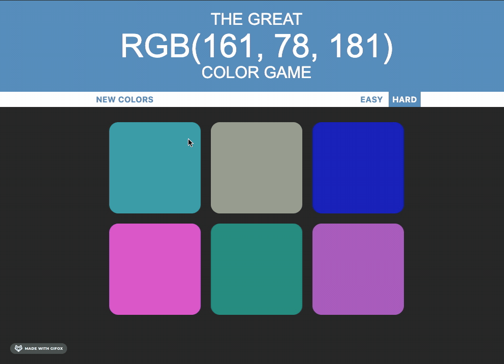

# CSS Color Game

## About the App

    A game that allows user to practice their CSS RGB value.
    The game will give a randomized CSS RGB value (ex. rgb(255,0,0))
    and the user will then choose the corresponding color that matches the
    given RGB value.

    There are two modes, hard and easy. There will be 3 colors to choose from
    on easy mode, and 6 colors to choose from on hard mode.
    
## Play the game here:
    
    https://russtelen-color-game.netlify.app

## Technologies Used
- HTML
- CSS
- JavaScript
- jQuery
- Bootstrap 3

## App Preview

